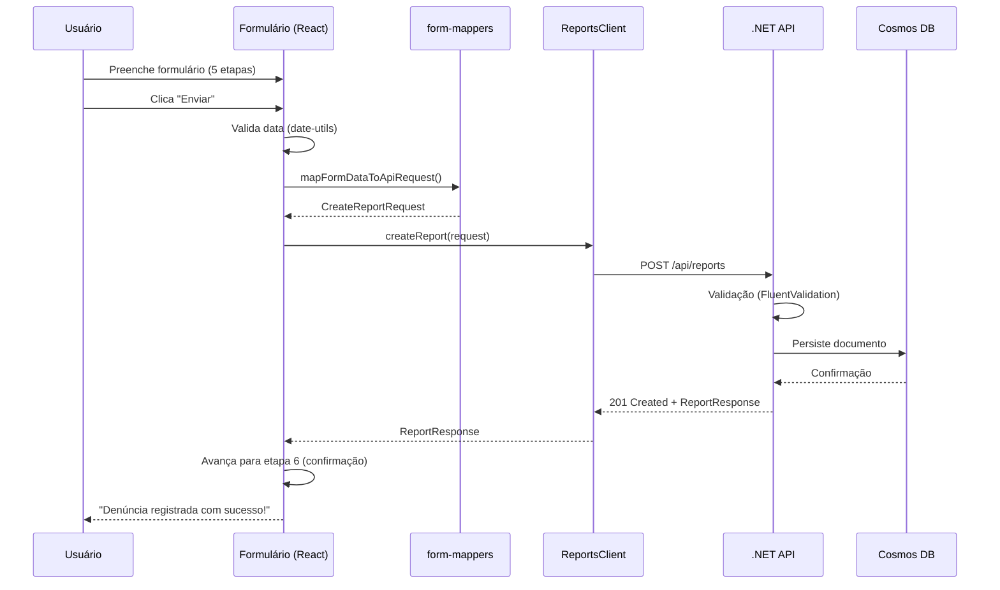

# Integração Frontend-Backend: Resumo da Implementação

## 📋 Visão Geral

Foi implementada a integração completa entre o formulário de denúncias do frontend (Next.js) e a API de reports (ASP.NET Core), seguindo todas as convenções estabelecidas no projeto.

## ✅ O que foi Implementado

### 1. **Cliente HTTP da API** (`web/lib/api/`)

#### `types.ts`
- Interfaces TypeScript que espelham os modelos C# da API
- Tipos para request/response: `CreateReportRequest`, `ReportResponse`, `ApiError`
- Documentação JSDoc em português (seguindo convenções)

#### `reports-client.ts`
- Classe `ReportsClient` para comunicação com a API
- Métodos implementados:
  - `createReport()`: Cria nova denúncia
  - `getAllReports()`: Lista todas as denúncias
  - `getReportById()`: Busca por ID
  - `getReportsByCrimeGenre()`: Filtra por gênero de crime
- Tratamento robusto de erros com `ApiResponseError`
- Suporte a variável de ambiente `API_BASE_URL`

#### `index.ts`
- Ponto de entrada centralizado para exportações

### 2. **Utilitários** (`web/lib/utils/`)

#### `date-utils.ts`
- `convertToIsoDate()`: Converte DD/MM/YYYY → ISO 8601
- `isValidDateString()`: Valida formato de data
- Lida com datas inválidas (ex: 31/02)

#### `form-mappers.ts`
- Mapas para: crimeGenre, crimeType, ageGroup, genderIdentity, sexualOrientation, ethnicity, resolved
- Função `mapFormDataToApiRequest()`: conversão automática

### 3. **Componente de Denúncia Atualizado**

#### `web/app/components/denuncia/denuncia.tsx`
- **Estados adicionados**:
  - `depoimento`: armazena o texto da descrição
  - `location`: localização (preparado para integração com mapa)
  - `isSubmitting`: controla loading durante envio
  - `submitError`: exibe mensagens de erro

- **Funções implementadas**:
  - `handleSubmit()`: Envia dados para API
    - Valida data de ocorrência
    - Mapeia dados do formulário
    - Trata erros de validação e rede
    - Avança para tela de confirmação em sucesso
  - `resetForm()`: Limpa todos os campos
  - `handleClose()`: Fecha modal e reseta após animação

- **Melhorias de UX**:
  - Botão "Enviar" desabilitado durante submissão
  - Feedback visual de erro na etapa 5
  - Mensagem de loading "Enviando..."
  - Botão "Fechar" na tela de confirmação

### 4. **Configuração de CORS na API**

#### `api/Program.cs`
- Adicionado middleware CORS
- Configuração via `appsettings.json`
- Permite origens configuráveis por ambiente
- Headers expostos: `Location` (para 201 Created)

#### `api/appsettings.json` e `api/appsettings.Development.json`
- Seção `Cors:AllowedOrigins` configurável
- Desenvolvimento: `http://localhost:3000` e `https://localhost:3000`
- Produção: adicionar domínio do Azure Static Web Apps

### 5. **Documentação**

#### `docs/api-integration.md`
- Guia completo de integração
- Configuração passo a passo
- Exemplos de uso do cliente
- Tabela de mapeamento de dados
- Troubleshooting comum
- Próximos passos sugeridos

## 🎯 Fluxo Completo de Envio



## 📁 Estrutura de Arquivos Criados/Modificados

```
api/
├── Program.cs                      ✏️ Modificado (CORS)
├── appsettings.json                ✨ Criado
└── appsettings.Development.json    ✨ Criado

web/
├── .env.example                    ✨ Criado
├── lib/
│   ├── api/
│   │   ├── index.ts               ✨ Criado
│   │   ├── types.ts               ✨ Criado
│   │   └── reports-client.ts      ✨ Criado
│   └── utils/
│       ├── date-utils.ts          ✨ Criado
│       └── form-mappers.ts        ✨ Criado
└── app/
    └── components/
        └── denuncia/
            └── denuncia.tsx        ✏️ Modificado

docs/
└── api-integration.md              ✨ Criado
```

## 🔧 Configuração Necessária

### Frontend (Next.js)

1. **Criar `.env.local`**:
```bash
cd web
cp .env.example .env.local
```

2. **Editar `.env.local`**:
```env
API_BASE_URL=https://localhost:5001
```

3. **Instalar dependências** (se necessário):
```bash
npm install
```

### Backend (.NET)

1. **Configurar Cosmos DB** em `appsettings.Development.json`:
```json
{
  "CosmosDB": {
    "ConnectionString": "sua-connection-string-aqui"
  }
}
```

2. **Adicionar origens permitidas** (produção) em `appsettings.json`:
```json
{
  "Cors": {
    "AllowedOrigins": [
      "http://localhost:3000",
      "https://your-app.azurestaticapps.net"
    ]
  }
}
```

## 🚀 Como Testar

### 1. Iniciar a API

```powershell
cd api
dotnet run
```

A API estará disponível em `https://localhost:5001`

### 2. Iniciar o Frontend

```powershell
cd web
npm run dev
```

O frontend estará em `http://localhost:3000`

### 3. Testar o Formulário

1. Acesse `http://localhost:3000`
2. Clique em "Fazer Denúncia"
3. Preencha todas as etapas do formulário
4. Na etapa 5, clique em "Enviar"
5. Verifique a mensagem de sucesso
6. Confira no Cosmos DB que o documento foi criado

### 4. Verificar Erros Comuns

#### CORS Error
```
Access to fetch [...] has been blocked by CORS policy
```
**Solução**: Verifique se `app.UseCors("AllowFrontend")` está no `Program.cs`

#### Connection Refused
```
Failed to fetch
```
**Solução**: Confirme que a API está rodando na porta 5001

#### Validation Error
```
Erro de validação: description: The description field is required
```
**Solução**: Preencha todos os campos obrigatórios no formulário

## 📊 Mapeamento de Dados

### Exemplo de Conversão

**Dados do Formulário**:
```typescript
{
  tipoRelato: "Crime",
  natureza: "Assalto ou tentativa de assalto",
  dataOcorrencia: "15/01/2025",
  depoimento: "Fui abordado na rua...",
  resolvido: "Não",
  faixaEtaria: "18 - 29",
  genero: "Homem Cisgênero",
  orientacaoSexual: "Heterossexual",
  racaCor: "Parda"
}
```

**Payload da API**:
```json
{
  "crimeGenre": "crime",
  "crimeType": "robbery",
  "description": "Fui abordado na rua...",
  "location": "Brasília, DF",
  "crimeDate": "2025-01-15T00:00:00.000Z",
  "reporterDetails": {
    "ageGroup": "18-29",
    "ethnicity": "mixed",
    "genderIdentity": "cisgender-man",
    "sexualOrientation": "heterosexual"
  },
  "resolved": false
}
```

## 🎨 Padrões Seguidos

✅ **Código em inglês**: Nomes de variáveis, funções, classes  
✅ **Comentários em português**: JSDoc e inline comments  
✅ **camelCase**: Variáveis, propriedades, campos JSON  
✅ **PascalCase**: Classes, tipos, interfaces  
✅ **kebab-case**: Arquivos e pastas  
✅ **Tratamento de erros robusto**: Try-catch com tipos específicos  
✅ **Validação**: Cliente e servidor  
✅ **Separação de responsabilidades**: Cliente HTTP, utilitários, mapeadores  
✅ **Documentação**: README e JSDoc completos  

## 🔮 Próximos Passos Sugeridos

### Alta Prioridade
- [ ] **Integração com mapa**: Capturar coordenadas reais do `MapaDepoimentos`
- [ ] **Testes E2E**: Playwright para fluxo completo
- [ ] **Feedback visual**: Loading spinner, toast notifications

### Média Prioridade
- [ ] **Validação em tempo real**: Validar campos enquanto usuário digita
- [ ] **Persistência local**: Salvar rascunho no localStorage
- [ ] **Retry logic**: Reenvio automático em falha de rede

### Baixa Prioridade
- [ ] **Upload de imagens**: Anexar fotos da ocorrência
- [ ] **Geolocalização automática**: Usar GPS do dispositivo
- [ ] **Histórico de denúncias**: Permitir usuário ver suas denúncias (com auth)

## 📞 Suporte

Em caso de dúvidas ou problemas:

1. Consulte `docs/api-integration.md`
2. Revise as convenções em `docs/conventions.md`
3. Abra uma issue no GitHub
4. Contate a equipe no Discord

---

**Data de Implementação**: Janeiro 2025  
**Versão**: 1.0.0  
**Status**: ✅ Completo e Funcional
