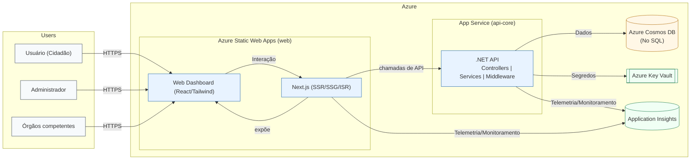

# **Visão Geral do Produto: Amaterasu - Safe Zone**


O **Amaterasu - Safe Zone** é uma aplicação web em formato de dashboard projetada para analisar e processar dados sobre criminalidade e insegurança no Distrito Federal e entorno. O objetivo é informar os cidadãos, facilitar a denúncia de ocorrências de forma menos burocrática e auxiliar na tomada de decisões mais direcionadas por parte dos órgãos competentes.

## **Problema a ser Solucionado**

Com a velocidade da internet, a disseminação de notícias sobre perigos e crimes tornou-se extremamente rápida. O produto visa utilizar essa agilidade para criar uma comunicação democrática sobre os perigos, permitindo que a população seja alertada sobre a incidência de problemas em regiões específicas. A plataforma busca quebrar a burocracia, permitindo o registro de relatos informais que muitas vezes não se enquadram em um boletim de ocorrência tradicional, como locais mal iluminados, movimentações suspeitas ou situações de assédio.

## **Objetivos e Diferenciais**

O principal objetivo do projeto é coletar e processar denúncias relacionadas à segurança no DF, garantindo sempre a privacidade e o anonimato dos usuários. Após o registro de uma denúncia, a plataforma informará ao usuário sobre como ele pode agir diante daquela situação.

Como objetivos secundários, o projeto visa:
* Permitir que órgãos competentes (como CEB, corpo de bombeiros e polícia civil) utilizem os dados visuais dos dashboards para criar estratégias mais eficazes e direcionadas.
* Alertar a população sobre áreas de risco ou perigos recentes, melhorando o acesso à informação.

## **Perfis de Usuário**

O sistema contará com dois perfis de acesso principais:
* **Administrador:** Terá acesso para controlar os dashboards e gerenciar os dados do banco, podendo remover informações se necessário.
* **Usuário:** Poderá visualizar os dados, criar novos relatos no mapa interativo e consultar o dashboard de informações.

## Diagrama do Produto

O diagrama abaixo representa, em alto nível, os atores, o Web Dashboard exposto pelo Next.js, e os principais componentes na Azure: Azure Static Web Apps (Next.js com SSR/SSG/ISR), APIs .NET no App Service (Controllers/Services/Middleware), Cosmos DB, Key Vault e Application Insights.



Legenda rápida:
- Frontend: Next.js hospedado em Azure Static Web Apps, renderiza React/Tailwind e realiza chamadas server-side para a API .NET (evitando CORS). Client-side fetch é opcional e requer CORS.
- .NET API (App Service): controllers finos; regras de negócio em services; middleware de erros padronizados.
- Cosmos DB: persistência (Core SQL), propriedades camelCase.
- Key Vault: segredos referenciados via App Settings.
- Application Insights: telemetria entre serviços.


## **Tecnologias Utilizadas**

A equipe de desenvolvimento utilizará as seguintes tecnologias para a construção do produto:
* **Frontend (Web):** Next.js (App Router, SSR/SSG/ISR), React e Tailwind CSS.
* **APIs:** C#/.NET 9 (Controllers finos; regras em Services; Middleware central de erros/logs).
* **Hospedagem:** Azure Static Web Apps (Next.js) e Azure App Service (APIs .NET).
* **Banco de Dados:** Azure Cosmos DB (Core SQL), com propriedades em camelCase.
* **Segurança e Segredos:** Azure Key Vault + App Settings.
* **Observabilidade:** Azure Application Insights.
* **Metodologia:** Scrum, com sprints semanais.
* **Ferramentas:** Azure, GitHub Actions, Discord, Google Docs, GitHub, Git, VSCode, entre outras.

## Como começar (dev)

Esta seção descreve rapidamente como configurar e iniciar o repositório localmente para desenvolvimento, seguindo as convenções do projeto.

### Estrutura do repositório

```
.
├─ web/   # Next.js (App Router) + Tailwind
└─ api/   # ASP.NET Core 9 (Cosmos DB / App Insights)
```

### Pré-requisitos

- Node.js 18+ (recomendado 20+)
- PNPM/NPM/Yarn (ex.: npm)
- .NET SDK 9.0+
- Conta Azure

### Configuração (desenvolvimento)

1) API (.NET)

- No desenvolvimento local, configure via arquivo: edite `api/appsettings.Development.json` (não versionado por padrão pelo `.gitignore`). Preencha os campos mínimos:

```json
{
	"CosmosDB": {
		"ConnectionString": "<sua-cosmos-connection-string>",
		"DatabaseId": "ReportsDb",
		"ContainerId": "Reports"
	},
	"ApplicationInsights": {
		"ConnectionString": "<opcional>"
	},
	"Cors": {
		"AllowedOrigins": [
			"https://localhost:3000"
		]
	}
}
```

- Porta/local por padrão (launchSettings):
		- HTTP: http://localhost:5206
		- HTTPS: https://localhost:7040

- CORS: ajuste `Cors:AllowedOrigins` no `appsettings.Development.json` para incluir o front (`https://localhost:3000`).

2) Web (Next.js)

- A base de URL da API é lida de `NEXT_PUBLIC_API_BASE_URL`. O cliente já usa por padrão `http://localhost:5206`.
- Se precisar customizar, crie `web/.env.local`:

```bash
cd web
npm install
printf "NEXT_PUBLIC_API_BASE_URL=http://localhost:5206\n" > .env.local
```

### Subindo os serviços

Em dois terminais:

1) API
```bash
cd api
dotnet restore
dotnet build
dotnet run
```

2) Web
```bash
cd web
npm install
npm run build
npm run lint
npm run dev
```

### Verificação rápida

- Front-end: http://localhost:3000
- Swagger (API):
	- https://localhost:7040/swagger
	- ou http://localhost:5206/swagger

## Documentação e convenções

- Documentação geral: veja a pasta `docs/` (ex.: [`docs/README.md`](./docs/README.md))
- Convenções do projeto (estrutura, branches, padrões): [`docs/conventions.md`](./docs/conventions.md)
- Guia rápido e integrações: [`docs/QUICK_START.md`](./docs/QUICK_START.md), [`docs/api.md`](./docs/api.md), [`docs/api-integration.md`](./docs/api-integration.md)
