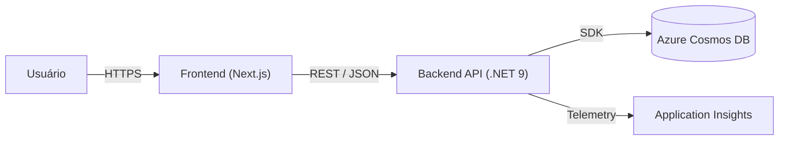
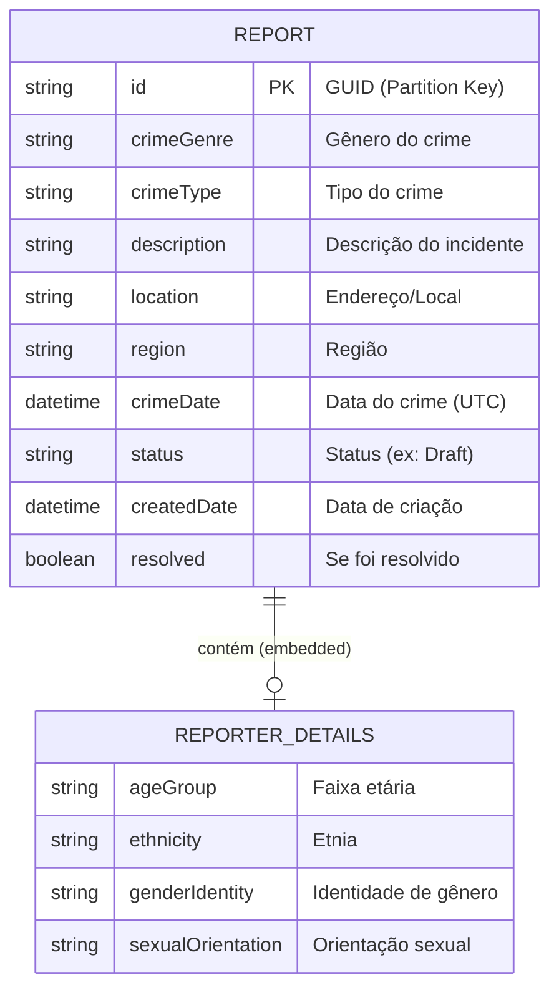

# Arquitetura do Projeto Safe Zone

## 1. Arquitetura (Visão Geral)

O projeto segue uma arquitetura moderna de **Single Page Application (SPA)** com um backend desacoplado (API RESTful) e banco de dados NoSQL em nuvem.

Em termos de padrão arquitetural, o backend é classificado como uma **Arquitetura Monolítica em Camadas**. Embora utilize o framework MVC do ASP.NET Core, a estrutura é definida pela separação lógica de responsabilidades (Apresentação, Serviço, Dados) dentro de uma única unidade de implantação (Monolito), o que facilita o desenvolvimento inicial e a manutenção.

**Esquema de Alto Nível:**

*   **Frontend:** Aplicação web construída com **Next.js** (React), utilizando TypeScript e Tailwind CSS. Possui integração com mapas (`leaflet`) e usa a autenticação nativa do Azure Static Web Apps (Azure AD/Entra ID) para proteger a área administrativa.
*   **Backend:** Web API desenvolvida em **.NET 9** (C#). Responsável pela lógica de negócios, validação e persistência de dados.
*   **Banco de Dados:** **Azure Cosmos DB** (NoSQL), utilizado para armazenar os relatórios de crimes de forma escalável e flexível.
*   **Observabilidade:** Integração com **Azure Application Insights** para monitoramento de logs e telemetria (incluindo consumo de RUs do Cosmos DB).

---

## 2. Visão Lógica

A aplicação backend está estruturada em camadas lógicas para separação de responsabilidades:

*   **Camada de Apresentação (Controllers):**
    *   Expõe endpoints REST (ex: `ReportsController`).
    *   Recebe requisições HTTP e DTOs (`CreateReportRequest`, `UpdateReportRequest`).
    *   Retorna respostas padronizadas (`ReportResponse`).
*   **Camada de Serviço (Services):**
    *   Contém a regra de negócios principal (`ReportService`).
    *   Realiza normalização de dados (ex: datas para UTC, trim de strings).
    *   Gerencia a lógica de telemetria customizada (`CosmosTelemetry`).
*   **Camada de Dados (Data Access):**
    *   Não utiliza um ORM tradicional (como Entity Framework), mas sim o **SDK nativo do Azure Cosmos DB** para máxima performance.
    *   O acesso é feito diretamente via `Container` injetado no serviço.
*   **Configuração:**
    *   Utiliza o padrão `IOptions` para injetar configurações (`CosmosOptions`) a partir do `appsettings.json`.

---

## 3. Visão de Dados (DER-MER / Modelo de Documento)

Como o banco de dados é o **Azure Cosmos DB (NoSQL)**, não existe um DER (Diagrama Entidade-Relacionamento) relacional tradicional com tabelas e chaves estrangeiras. Em vez disso, temos um **Modelo de Documento** onde os dados são armazenados como JSON.

A entidade principal é o **Report**, que é armazenado em um container (chamado `Reports`).

**Modelo de Entidade (Documento JSON):**

**Detalhes do Modelo:**
*   **Particionamento:** A chave de partição (`PartitionKey`) é o próprio `/id`, para uma estratégia otimizada para leituras por ID (Point Reads), mas que pode exigir *cross-partition queries* para buscas por outros campos se o volume de dados for muito grande.
*   **ReporterDetails:** É um objeto aninhado (embedded) dentro do documento do relatório, não uma tabela separada. Isso é típico de modelagem NoSQL para evitar *joins*.
